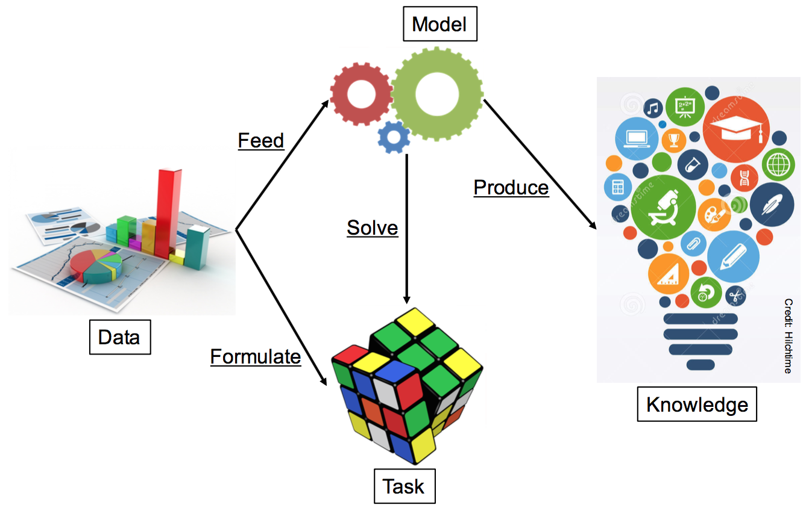
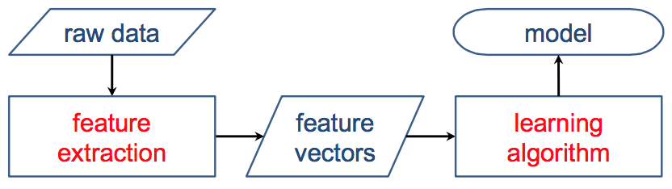

# 從資料到知識：從零開始的資料探勘

- [講座連結](http://datasci.tw/intro-mining.html)
- [簡報連結](http://www.slideshare.net/tw_dsconf/ss-64145214)

## 從資料到目標，從目標到知識 (Data Mining: From Data to Task to Knowledge)

### 簡介資料探勘 (Introduction to Data Mining)
#### 什麼是資料探勘
- 從資料抽取有用的資訊
- 將資料轉換為可理解的結構
- 資料庫知識發掘(knownledge discovery in database, KDD)的分析步驟

#### 真實世界的應用
- Googole Search Engine
- Spam Filtering
- Advertising
- Recommender Systems
- Facebook Newsfeed

#### 但真實世界的資料很雜亂
- 沒有組織化
- 大部份是伺服器的 logs
- 問題可能難以直接解決

#### 資料探勘與其他技術的重疊
- Database - Large-scale Data 
- Machine Learning - Learning Model
- CS Theory - Algorithms

### 資料探勘中的任務與模型 (Tasks and Models in Data Mining)

#### 資料探勘中的模型
建立模型以解決問題，模型的特性
- 有效 - 有確定性的新資料
- 新穎 - 得到原系統無法明顯觀察到的結果
- 有用 - 能做出行動 (預期股市會漲：可產生行動，他是個禿子：無法產生行動)
- 可理解 - 人類應該可以解釋模式 (pattern)

#### 資料探勘中的任務
- 解決問題前應該明確的表達問題

兩種任務
- 預測型
  - 處理未知的值，例如分類
  - 分類(Classification)、迴歸(Regression)、排名(Ranking)...
- 描述型
  - 找到模式與描述資料，例如社群分群
  - 分群(Clustering)、摘要(Summarization)、關聯規則學習(Association Rule Learning)

#### 分類(Classification)
- 概括**已知**的結構，應用在**未知**的資料
- 學習 classifier 模型分類新資料
- 例如，給訂目前的社交網路，預測兩個節點是否會在未來連結

#### 迴歸(Regression)
- 找出能用最小誤差描述一群資料的函數
- 輸出可能是數值
- 例如，預測搜尋引擎廣告的點擊率(click-through rate, CRT)

#### 排名(Ranking)
- 產生項目的名次排列
- 位置越高的項目越重要
- 例如，搜尋引擎的結果 (越上面的連結越有相關性)

#### 分群(Clustering)
- 發現資料的群聚(groups)與結構(structures)
- 在不知道資料結構的情況下，學習分群
- 例如，根據標誌位置的照片，找出興趣點

> Wiki: 興趣點（point of interest, POI）乃是電子地圖上的某個地標、景點，用以標示出該地所代表的政府部門、各行各業之商業機構（加油站、百貨公司、超市、餐廳、酒店、便利商店、醫院等）、旅遊景點（公園、公共廁所等）、古蹟名勝、交通設施（各式車站、停車場、超速照相機、速限標示）等處所。

#### 摘要(Summarization)
- 呈現更精簡的資訊 (compact representation)
- 文本類型 - 文章摘要
- 一般資訊 - 資訊視覺化
- 例如，將網頁內容濃縮成精簡但完整的片段 (snippet)

#### 關聯規則學習(Association Rule Learning)
- 發掘變數間的關係
- 發現的關係可能對應用或分析有幫助
- 例如，啤酒與尿布、偵測網路上的隱私權漏洞

#### 合併多個任務
- 分解問題為多個任務
- 例如，使用 Twitter 偵測事件
  - 先分類：將 tweets 分類成各種事件
  - 後迴歸：某 tweets 是在說某事件嗎？ (評估可能性)

### 資料探勘中的機器學習 (Machine Learning in Data Mining)

#### 從機器學習的觀點
- 利用演算法來學習模型
- 資訊編碼為特徵向量 (feature vectors)
- 特徵與模型的選取很重要

#### 機器學習模型的種類
- 不同演算法適用於不同資料
- 依賴於資料本身與應用場景

#### 監督式學習 vs. 非監督式學習
- 監督式學習 (Supervised Learning)
  - with labeled data: 使用有標籤的資料學習，例如分類
- 非監督式學習 (Unsupervised Learning)
  - without labeled data: 使用無標籤的資料學習，例如分群

#### 半監督式學習 (Semi-supervised Learning)
- 使用有標籤與無標簽的資料學習
- 主要想法：類似的資料有類似的標籤
- 例如，自動幫未上標籤的資料上標籤

#### 增強學習 (Reinforcement Learning)
- 沒有明確的標籤，但能從環境中隱約觀察到
- 從環境隱約回饋中學習
- 例如，AlphaGO 每步驟沒有明確的標籤，只有「輸贏」的隱約回饋

### 創新：從資料到任務到知識 (Innovation: from Data to Task to Knowledge)

#### 兩個關鍵基礎
- 資料：資訊來源
- 任務：要解決的問題

***Then the model can solve the task with data and produce knowledge!***

#### 資料在哪裡？到處都是！
- 社群服務 (Facebook, Twitter, ...)
- 網路 (sockal networks, road networks, ...)
- 感應器 (time-series, ...)
- 影像 (photos, fMRI, ...)
- 文本 (news, documents)
- 網頁 (forums, websites, ...)
- 公開資料 (populations, ubike logs, ...)
- 商業資料 (transactions, customers, ...)
- 更多

#### 資料挖掘如何革新？

#### 資料驅動
- 從特地資料引入任務：可以對資料做什麼？
  - 對於空氣品質：推測目前品質、預測未來品質、監測站選擇 
  - 對於社會事件：找到潛在客戶、推薦事件、用戶影響排名

#### 問題驅動
- 針對特定任務搜集相關資料：什麼資料有助於解決問題？
  - 音樂推薦：聆聽紀錄、音樂標籤、社群網路
  - 交通評估：氣象、過去的交通、社群網路

### 資料探勘工具 (Tools for Data Mining)

## 從資料中發現蛛絲馬跡：特徵抽取與選擇 (Clues in Data: Features Extraction and Selection)

### 資料探勘中的特徵 (Features in Data Mining)
### 特徵抽取 (Feature Extraction)
### 特徵與性能 (Features and Performance)
### 特徵的選擇 (Feature Selection)
### 特徵的縮減 (Feature Reduction)

## 發現資料中的小團體：分群與其應用 (Small Circles in Data: Clustering and its Applications)

### 介紹分群 (Introduction to Clustering)
### 階級分群 (Hierarchical Clustering)
### 切割分群 (Partitional Clustering)
### 分群的應用 (Applications of Clustering)

## 沒有特徵該怎麼辦？從推薦系統談起 (No Features? Starting from Recommender Systems)

### 介紹推薦系統 (Introduction to Recommender System)
### 根據內容過濾 (Content-based Filtering)
### 協同式過慮 (Collaborative Filtering)
### 潛在因素模型 (Latent Factor Models)
### 潛在因素模型的變化 (Variations of Latent Factor Models)
