# 從資料到知識：從零開始的資料探勘

- [講座連結](http://datasci.tw/intro-mining.html)
- [簡報連結](http://www.slideshare.net/tw_dsconf/ss-64145214)

## 從資料到目標，從目標到知識 (Data Mining: From Data to Task to Knowledge)

### 簡介資料探勘 (Introduction to Data Mining)
#### 什麼是資料探勘
- 從資料抽取有用的資訊
- 將資料轉換為可理解的結構
- 資料庫知識發掘(knownledge discovery in database, KDD)的分析步驟

#### 真實世界的應用
- Googole Search Engine
- Spam Filtering
- Advertising
- Recommender Systems
- Facebook Newsfeed

#### 但真實世界的資料很雜亂
- 沒有組織化
- 大部份是伺服器的 logs
- 問題可能難以直接解決

#### 資料探勘與其他技術的重疊
- Database - Large-scale Data 
- Machine Learning - Learning Model
- CS Theory - Algorithms

### 資料探勘中的任務與模型 (Tasks and Models in Data Mining)

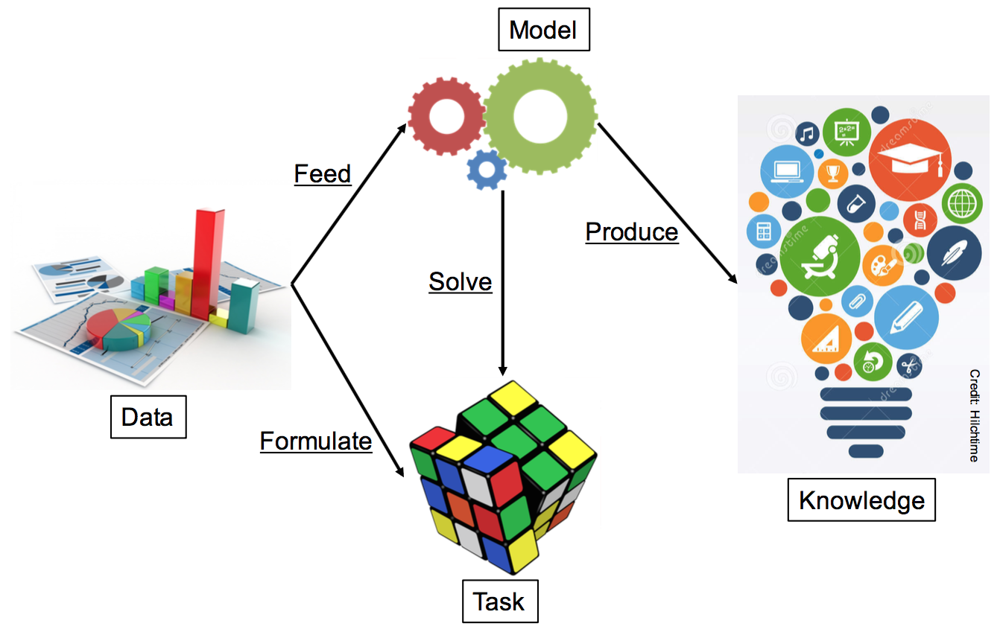

#### 資料探勘中的模型
建立模型以解決問題，模型的特性
- 有效性 - 有明確的新資訊
- 新穎性 - 得到原來無法明顯觀察到的結果
- 有用處 - 能藉此做出行動 (預期股市會漲：可產生行動，他是個禿子：無法產生行動)
- 可理解 - 人類應該可以解釋模式 (pattern)

#### 資料探勘中的任務
- 解決問題前應該明確的表達問題

兩種任務
- 預測型
  - 處理未知的值，例如分類
  - 分類(Classification)、迴歸(Regression)、排名(Ranking)...
- 描述型
  - 找到模式與描述資料，例如社群聚類
  - 聚類(Clustering)、摘要(Summarization)、關聯規則學習(Association Rule Learning)

#### 分類(Classification)
- 概括**已知**的結構，應用在**未知**的資料
- 學習 classifier 模型分類新資料
- 例如，給訂目前的社交網路，預測兩個節點是否會在未來連結

#### 迴歸(Regression)
- 找出能用最小誤差描述一群資料的函數
- 輸出可能是數值
- 例如，預測搜尋引擎廣告的點擊率(click-through rate, CRT)

#### 排名(Ranking)
- 產生項目的名次排列
- 位置越高的項目越重要
- 例如，搜尋引擎的結果 (越上面的連結越有相關性)

#### 聚類(Clustering)
- 發現資料的群聚(groups)與結構(structures)
- 在不知道資料結構的情況下，學習聚類
- 例如，根據標誌位置的照片，找出興趣點

> Wiki: 興趣點（point of interest, POI）乃是電子地圖上的某個地標、景點，用以標示出該地所代表的政府部門、各行各業之商業機構（加油站、百貨公司、超市、餐廳、酒店、便利商店、醫院等）、旅遊景點（公園、公共廁所等）、古蹟名勝、交通設施（各式車站、停車場、超速照相機、速限標示）等處所。

#### 摘要(Summarization)
- 呈現更精簡的資訊 (compact representation)
- 文本類型 - 文章摘要
- 一般資訊 - 資訊視覺化
- 例如，將網頁內容濃縮成精簡但完整的片段 (snippet)

#### 關聯規則學習(Association Rule Learning)
- 發掘變數間的關係
- 發現的關係可能對應用或分析有幫助
- 例如，啤酒與尿布、偵測網路上的隱私權漏洞

#### 合併多個任務
- 分解問題為多個任務
- 例如，使用 Twitter 偵測事件
  - 先分類：將 tweets 分類成各種事件
  - 後迴歸：某 tweets 是在說某事件嗎？ (評估可能性)

### 資料探勘中的機器學習 (Machine Learning in Data Mining)

#### 從機器學習的觀點
- 利用演算法來學習模型
- 資訊編碼為特徵向量 (feature vectors)
- 特徵與模型的選取很重要

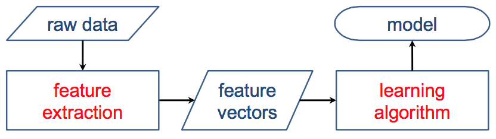

#### 機器學習模型的種類
- 不同演算法適用於不同資料
- 依賴於資料本身與應用場景

#### 監督式學習 vs. 非監督式學習
- 監督式學習 (Supervised Learning)
  - with labeled data: 使用有標籤的資料學習，例如分類
- 非監督式學習 (Unsupervised Learning)
  - without labeled data: 使用無標籤的資料學習，例如聚類

#### 半監督式學習 (Semi-supervised Learning)
- 使用有標籤與無標簽的資料學習
- 主要想法：類似的資料有類似的標籤
- 例如，自動幫未上標籤的資料上標籤

#### 增強學習 (Reinforcement Learning)
- 沒有明確的標籤，但能從環境中隱約觀察到
- 從環境隱約回饋中學習
- 例如，AlphaGO 每步驟沒有明確的標籤，只有「輸贏」的隱約回饋

> [机器学习算法之旅](http://blog.jobbole.com/60809/) 增强学习：输入数据可以刺激模型并且使模型做出反应。反馈不仅从监督学习的学习过程中得到，还从环境中的奖励或惩罚中得到。问题例子是机器人控制，算法例子包括Q-learning以及Temporal difference learning。

### 創新：從資料到任務到知識 (Innovation: from Data to Task to Knowledge)

#### 兩個關鍵基礎
- 資料：資訊來源
- 任務：要解決的問題

***Then the model can solve the task with data and produce knowledge!***

#### 資料在哪裡？到處都是！
- 社群服務 (Facebook, Twitter, ...)
- 網路 (sockal networks, road networks, ...)
- 感應器 (time-series, ...)
- 影像 (photos, fMRI, ...)
- 文本 (news, documents)
- 網頁 (forums, websites, ...)
- 公開資料 (populations, ubike logs, ...)
- 商業資料 (transactions, customers, ...)
- 更多

#### 資料挖掘如何革新？

#### 資料驅動
- 從特定資料引入任務：可以對資料做什麼？
  - 對於空氣品質：推測目前品質、預測未來品質、監測站選擇 
  - 對於社會事件：找到潛在客戶、推薦事件、用戶影響排名

#### 問題驅動
- 針對特定任務搜集相關資料：什麼資料有助於解決問題？
  - 音樂推薦：聆聽紀錄、音樂標籤、社群網路
  - 交通評估：氣象、過去的交通、社群網路

### 資料探勘工具 (Tools for Data Mining)

#### 工具
- 圖形化介面
  - Weka
- 命行式介面
  - LIBSVM & LIBLINEAR
  - RankLib
  - Mahout
- 函式庫
  - scikit-learn
  - XGBoost

#### Weka
- http://www.cs.waikato.ac.nz/ml/weka/
- 功能：分類、回歸、聚類、關聯規則
- 優點：眾多模型、友善介面、容易視覺化
- 缺點：慢、參數調整、令人混亂的格式

#### scikit-learn
- http://scikit-learn.org/
- 功能：分類、迴歸、聚類、降維
- 優點：快速、彈性、眾多模式、參數調整
- 缺點：參數調整、自行處理資料、沒有圖形化介面、需要寫程式

#### LIBSVM & LIBLINEAR
- http://www.csie.ntu.edu.tw/~cjlin/libsvm/
- 功能：分類、迴歸
- 優點：高效能、純粹命令式介面、參數調整、固定資料格式
- 缺點：沒有圖形化介面、只有 SVM

#### RankLib
- http://www.lemurproject.org/
- 功能：排名
- 優點：眾多模式、純粹命令式介面、參數調整、固定資料格式
- 缺點：沒有圖形化介面、只有排名功能

## 從資料中發現蛛絲馬跡：特徵抽取與選擇 (Clues in Data: Features Extraction and Selection)

### 資料探勘中的特徵 (Features in Data Mining)

#### 真實世界的資料又髒又亂

#### 產品評估：我喜歡 iPhone 嗎？

“I bought an iPhone a few days ago. It is such a `nice phone`. The touch screen is `really cool`. The voice quality is `clear` too. It is much `better than my old Blackberry`, which was a `terrible phone` and so `difficult to type` with its `tiny keys`. `However`, my mother was `mad` with me as I did not tell her before I bought the phone. She also thought the phone was `too expensive`, ...” — An example from [Feldman, IJCAI ’13]

- 文章中參雜許多正面、負面的詞

#### 類似的照片
- 拉布拉多 還是 炸雞？ (棕色、團狀)
- 牧羊犬 還是 拖把？ (白色、長毛)

#### 人類如何區別照片
- 小狗：有眼睛、鼻子，很可愛
- 炸雞：可口、一塊塊、有翅膀

觀察到得以做出決定的重要特性 (properties)

#### 特徵 (fatures): 特性的描述
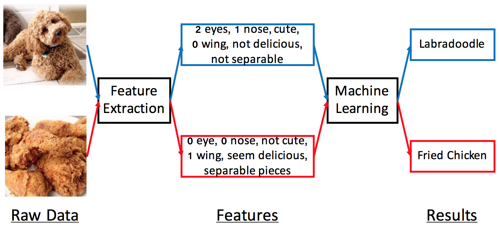

#### 一般化的描述
- 原始資料無法直接比較
- Features are same-length vectors with meaningful information.

### 特徵抽取 (Feature Extraction)

#### 如何抽取特徵
不同資料需要不同特徵
- 類別特徵 (Categorical features)
- 統計特徵 (Statistical features)
- 文本特徵 (Text features)
- 影像特徵 (Image features)
- 訊號特徵 (Signal features)

#### 類別特徵 (Categorical features)
- 有些資訊屬於種類，而非數值
  - 血型、天氣、出生地
- 從 n 種類別特徵擴充為 n 個二元數值特徵

血型 | A | B | AB | O
-----|---|---|----|---
Type A  | 1 | 0 | 0 | 0
Type B  | 0 | 1 | 0 | 0
Type AB | 0 | 0 | 1 | 0
Type O  | 0 | 0 | 0 | 1

#### 統計特徵 (Statistical features)
- 將數值編碼成特徵
  - 國民所得、一週交通
- 運用統計量測來呈現資料特性
  - 最大值、最小值、平均值、中位數、模數、標準差

#### 平均 vs 中位數
- outlier 嚴重影響統計結果
- 例如，國民所得資料：22k, 22k, 33k, 1000k
  - 平均值 = 269250 (= `(22k + 22k + 33k + 1000k) / 4`)
  - 中位數 = 27500 (= `(22000 + 33000) / 2`)
  - 哪個更有代表性？

#### 統計特徵適合分組資料 (grouped data)
- 不規律資料：1, 1, 1000000, 1000000
- 資料分成 n 組：可以包含 n 個統計特徵

傳統分組標準
- 時間 (年、月、日)
- 地區 (國家、州)
- 人口特徵 (年齡、性別)

#### 文本特徵 (Text features)
文字探勘很困難
- 高度變化與不確定性
  - 文本可以用不同語言、長度、標題編寫
- 字詞分割
  - 字母語言 (英文、法文): data science -> data + science
  - 非字母語言 (中文、日文): 全台大停電 -> 全台 + 大 + 停電 or 全 + 台大 + 停電
- 文法方式
  - 詞幹提取(stemming): cats -> cat; image, imaging -> imag
  - 詞形還原(lemmatization): fly, flies, flied -> fly; am, is, are -> be

#### 文法方式: Part-of-Speech (POS)
不同位置(詞性)呈現不同意義
- exploit: (N) 功績, (V) 利用
- 落漆: (Adj) 遜掉了, (V) 牆壁油漆脫落

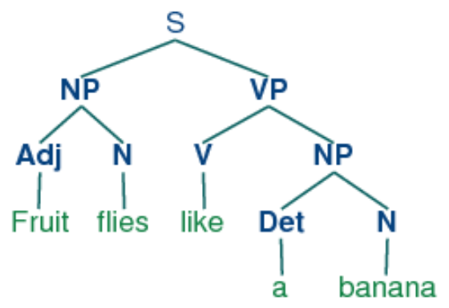

工具
- [NLTK](http://www.nltk.org/): Toolkit for English Natural Language Processing
- [jieba (結巴)](https://github.com/fxsjy/jieba): Toolkit for Chinese segmentation and tagging

#### 字詞頻率
- Bag-of-Words (BoW): A simplifying representation
  - 越頻繁的字詞越重要？
- Zipf's Law
  - 頻率越高的字可能越普通
- TF-IDF (Term Frequence x Inverse Document Frequence)
  - IDF(w) = log (|D| / df(w)), |D|: 所有文章數, df(w): 出現 w 的文章數
  - 降低經常出現字詞的重要性

#### Stopwords (無意義的字)
- 高頻但無意義
  - 英文：a, the, and, to, be, at, ...
  - 中文：的、了、嘛、吧、但是

#### 連續字詞
- 有些字詞合起來才有意義
  - 例如，Micheal, Jordan => Micheal Jordan
- Character-level n-gram: 得到字的模式
- Word-level n-gram: 得到片語的模式

#### Word2Vec
- 計算文字空間中兩個字的距離
  - 男人之於女人，國王之於王后

#### 影像特徵 (Image features)
影像由 pixel 所構成，特徵處理方式有
- Resizing: 轉換成相同大小
- pixel 位置不重要
- Scale-invariant Feature Transform (SIFT): 抽取區域關鍵 (local keypoints) 作為特徵，不隨大小(scaling)、旋轉(rotation)、轉換(translation) 而改變

#### Bag of Visual Words
- 應用 bag-of-word 的概念
  - TF-IDF 
  - keypoint clustering
  - visual-word vectors

#### CNN (Convolution Neural Network
- 來自多層CNN的特徵
  - 預先使用其他資料訓練
  - hidden layer = 特徵？

工具
- OpenCV
  - 內建 SIFT
  - 可連接 CNN 深度學習函式庫
- 深度學習函式庫
  - Tensorflow, Theano, Caffe

#### 訊號特徵 (Signal features)
來源
- 感應器資料
- 音樂
- 股票
- 動作
- 影像與影片

問題
- 多數為可變長度的時間序列資料 (time series data)

處理方式
- Sliding Window 從感興趣的位置抽取特定長度的資料
- Fourier Transform 從另一個 domain 觀察資料：將訊號分解成頻率

### 特徵與性能 (Features and Performance)
如何決定特徵的好壞？

不好的特徵會導致災難
- 模式會試著符合訓練資料
- 但模式可能無法符合其他(測試)資料

好的特徵可以提高效能
- 選擇較高效能的特徵

#### Evaluation for supervised models
準備資料
- 訓練資料 (training data) - 學習模式
- 評估資料 (evaluation data) - 調整模式
- 測試資料 (testing data) - 判斷效能

#### 評估分類

> 我覺得投影片的表有問題，以下是我自己的想法

        | Predict=1 (Positive) | Predict=0 (Negative)
--------|----------------------|----------------------
Truth=1 | TP                   | FN
Truth=0 | FP                   | TN

縮寫| 全名            | 說明                      | 預測結果
----|-----------------|---------------------------|----------
TP  | True Positive   | 真陽性：預測為真，事實為真| 成功
FP  | False Positive  | 偽陽性：預測為真，事實為假| 失敗
TN  | True Negative   | 真陰性：預測為假，事實為假| 成功
FN  | False Negative  | 偽陰性：預測為假，事實為真| 失敗

評估方式  | 公式 | 說明
----------|------|------
Accuracy  | `(TP + TN) / (TP + TN + FP + FN)` | The ratio of correct predictions 
Precision | `TP / (TP + FP)` | The ratio of correct predictions among positive prediction
Recall    | `TP / (TP + FN)` | The ratio of correct predictions among all such-class instances
F1-Score  | `2∙P∙R/(P+R)` | Consider precision and recall at the same time 

#### 評估遞迴
- MAE (Mean Absoluate Error): 預測距離真實結果有多接近
- RMSE (Root-mean-square error): 放大嚴重的錯誤

#### 評估排序
- Binary Relevance Ranking: 針對兩個類別 (有關連與無關聯)
  - Mean Average Precision (MAP)
  - Mean Reciprocal Rank (MRR)
  - Area under the Curve (AUC)
  - Precision at k (P@k)
- Graded Relevance Ranking: 相關可有多個級別 (分數1~5)
  - Normalized Discounted Cumulated Gain (NDCG)

#### 評估人工標籤

- 有些 ground truth (参考标准) 不可得
- 要得到 ground truth 需要人打標籤
- 每個標籤至少需要兩個人確認
- 上標籤的過程需要判斷
 
##### Cohen’s Kappa Coefficient (k)
- 評估兩個人做決定一致性
- P(a) 兩人有共識的機率
- P(b) 兩人隨機決定達成共識的機率
- k = (P(a) - P(e)) / (1 - P(e))
  - k > 0.8 很好
  - 0.67 ≤ k ≤ 0.8 還好
  - k < 0.67 不可靠

        | B (Yes) | B (No)
--------|---------|---------
A (Yes) | 20      | 5
A (No)  | 10      | 15

- P(a) = 25 + 15 / 50 = 0.7
- P(b) = 25/50 ∙ 30/50 + 25/50 ∙ 20/50 = 0.5
  - 25/50 ∙ 30/50: A 隨機說 Yes 且 B 隨機說 Yes 的機率
  - 25/50 ∙ 20/50: A 隨機說 No 且 B 隨機說 No 的機率
- k = (0.7 - 0.5) / (1 - 0.5) = 0.4

#### 評估聚類
- 聚類使用 corresponding classes C 作為 ground truth
- Purity
  - Compute accuracy by counting the correctly assigned instances
  - Purity will be unsuitable when the number of clusters is large.
- Normalized Mutual Information (NMI)

### 特徵的選擇 (Feature Selection)
- 特徵可能很多
- 特徵選擇應該系統化 (systematic) 與自動化 (automatic)
- 特徵分析很重要：了解為什麼模型可行

方法
- Wrapper Method
  - 嘗試所有組合找出最佳特徵集
  - 限制：2N 種組合
- Leave-one-out Analysis
  - 排除某特徵後，觀察訓練出來的 model 效能如何
  - 排除特徵後，效能變差 = 重要的特徵
- Filter Method
  - 訓練 model 前先選取特徵
  - 沒把特徵間的關聯性考慮進去
- Greedy Inclusion Algorithm
  - 根據測量，貪婪選擇前 k 個特徵 

#### 離散特徵的選擇標準
評估一個特徵的存在是否重要
- Docuemnt Frequency (DF)
  - 移除罕見特徵 （可能是雜訊、對最終決定沒有影響、不可能出現在新資料)
- X2 (chi-square) statistics (CHI)
  - ???
- Matual Information (MI)
  - 量測兩個離算變數 X, Y 之間的相關程度
- Information Gain (IG)
  - 知道某特徵是否存在，所獲得的資訊 ???

#### 數值特徵的選擇標準
評估 feature value 與 ground truth 的相依程度
- 相關性 (正相關、負相關)
- 一般相關係數
  - Pearson Correlation (γ) 
    - 假設兩個變數有線性關係 (越高、越重)
  - Spearman Rank Correlation (ρ)
    - 比較兩變數的排名次序
  - Kendall Rank Correlation (τ)
    - 比較兩變數的排名一致性

### 特徵的縮減 (Feature Reduction)
大規模資料有無數的特徵
- 高解析度影像 - 9600x7200 pixel
- 社群網路 - 226 個節點
- 大規模的文本語料庫 - 260 5-gram Bag-of-word terms
- 越多維度，越久的訓練時間

#### 維度縮減
- 目標：縮小特徵數量，且保有大部份資訊

那些應該保留
- 主要資訊：能呈現大部份資訊
  - Principal Component Analysis (PCA)：使用 principal components 將資料轉換到低維度空間
  - 80/20 法則：大部份的變化可以由少數 principal components 解釋
- 不相關資訊：能減少特徵數量

## 發現資料中的小團體：聚類與其應用 (Small Circles in Data: Clustering and its Applications)

### 介紹聚類 (Introduction to Clustering)
發現資料的群組 (groups) 與結構 (structures)

Given a set of points (features), group the points into clusters such that
- Points in a cluster are close/similar to each other
- Points in different clusters are dissimilar
- 通常，資料可能在高維度空間，相似性定義為量測到的距離。

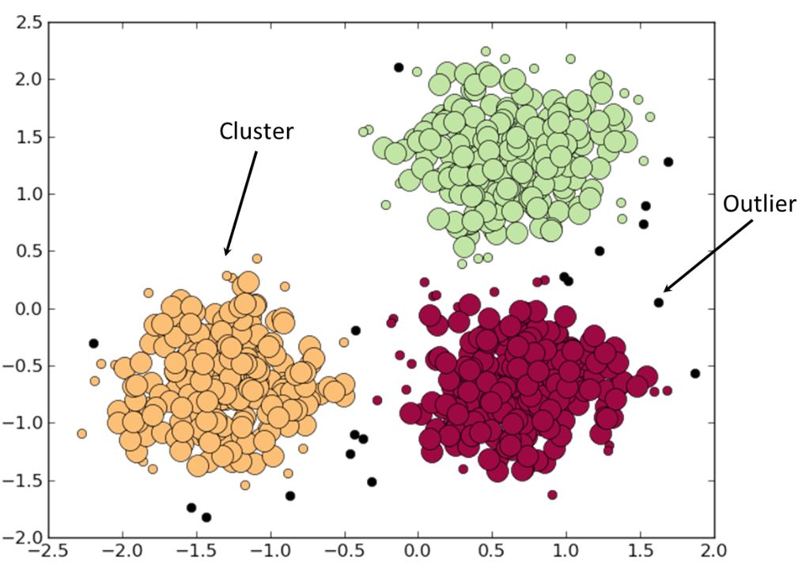

聚類方法的種類
- (階級聚類) Hierarchical Clustering - 假設聚類可以樹狀方式表示
- (階級聚類) Partitional Clustering - 維持一組 cluster，幫點找到屬於最近的 cluster

### 階級聚類 (Hierarchical Clustering)
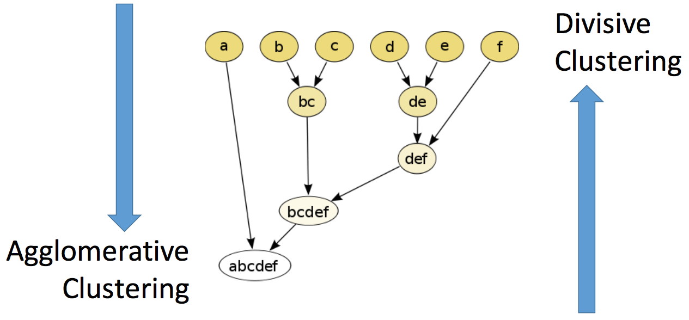

#### 演算法
- Agglomerative (bottom-up)
  - 一開始所有的點都是 cluster
  - 重複合併兩個最接近的點
- Divisive (top-down)
  - 一開始把所有的點當成一個 cluster
  - 然後重複分割

#### 兩個群的距離
- Single-link - 最近兩個點的距離
- Averge-link - 兩組點的平均距離
- Complete-link - 最遠兩個點的距離
- Centroid - 兩組點的中心距離

#### 實作時間複雜度
- Divisive: O(2n)
- Agglomerative: O(n3)
- 適用小型資料，不適合大規模資料

### 切割聚類 (Partitional Clustering)
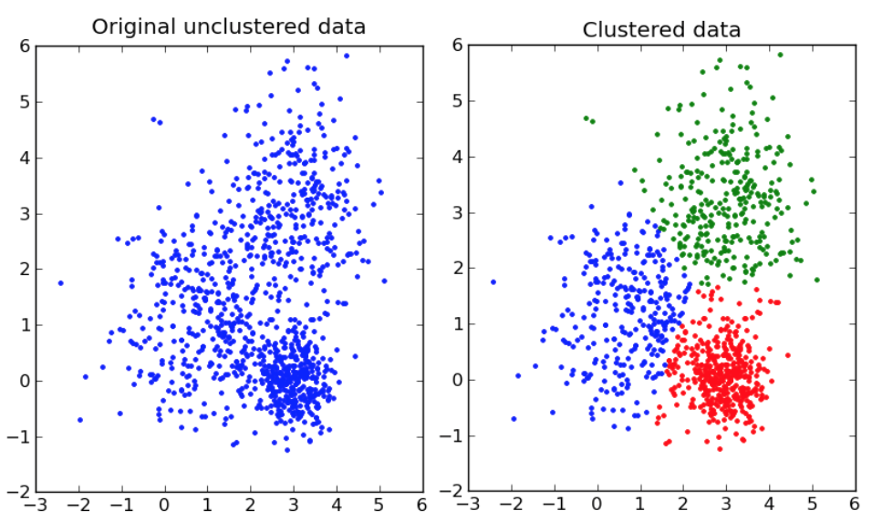

- K-means - simple partitional clustering method
- BFR algorithm - a variant of k-means for **large-scale and high-dimension data**
- CURE algorithm - allows clusters to assume any shape

#### K-means
將資料分成 K 個 clusters (K 由使用者定義)

1. 隨機選取 K 點當成初始質心 (initial centroid)
2. 把每個點分配到最鄰近的質心
3. 使用目前聚類的點，更新群的質心
4. 如果沒有達到結束條件，繼續步驟二

##### 結束條件

- 沒有點分配到不同的群
- 質心穩定

##### 優點
- 容易學習與實作
- 有效率 O(Kn) 
- 當 K 小，幾乎線性時間

##### 缺點
- K 需要人去定義
- 對於 outliers 敏感
- 對初始質心敏感

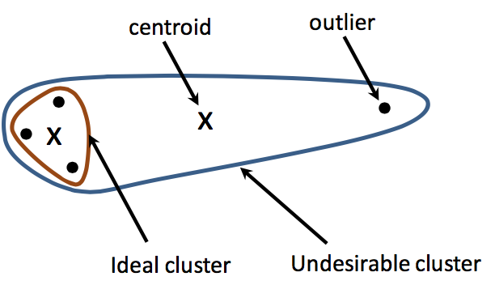

#### BFR Algorithm
- BFR [Bradley-Fayyad-Reina] 是 K-means 的變形
- 用來處理「大規模」與「高維度」的資料

##### 流程
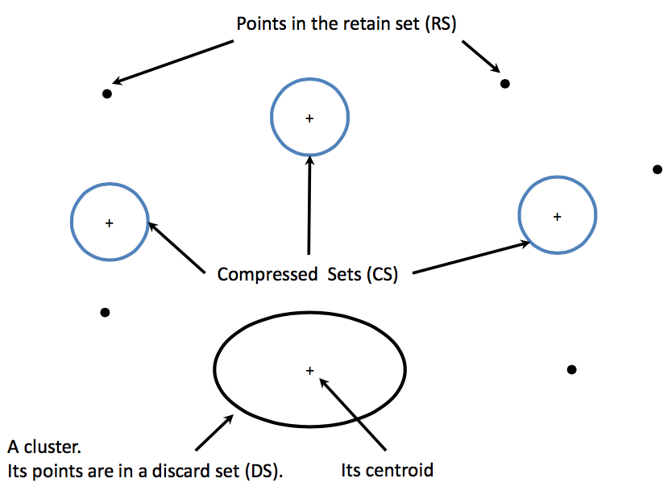

- 初始
  - 從 K-means 開始
- 將點分成三組
  - Discard Set (DS): 可被合併到 centroid 的點
  - Compression Set (CS): 相近的點，但無法合併到 centroid
  - Retained Set (RS): 被隔離的點，等待合併到 CS
- 把足夠接近的點加到 DS
- cluster 變成 CS(?)，outliers 變成 RS
- 最後一回合，合併 CS 與 RS 到最接近的 cluster

##### 多近算近
- Mahalanobis Distance
  - 假設 cluster 在d維度以常態分佈
  - 用標準差與 Mahalanobis Distance 決定 threshold 

#### CURE algorithm
- 用來處理任何形狀的 cluster

### 聚類的應用 (Applications of Clustering)
聚類中的物件有相似的特性
- 資料的內容
- 社會網路的通訊
- 相關的文章
- 有意義的圖片
- 標誌地理位置的點
- 音樂類型

聚類隱喻
- 特性發現 - A cluster might represent some specific properties
- 特性推論 - We can inference properties of unknown data from same-cluster data

#### 應用
- POI Identification: 透過 geo-located photos 找出 point-of-interests
- Community Detection: 找出社會網路節點構成的社群
- Document Type Discovery: 同一cluster內的文章屬於相同的類型
- Clustering in Information Retrieval: 關聯相近的文章傾向回應同一個查詢
- Search Results Clustering - 將查詢結果分成幾個群組

> Vivisimo是一個很有特色的元搜索引擎，它採用了一種專門開發的啟髮式演算法來集合或聚類原文文獻。這種演算法汲取了傳統人工智慧思想，強調對檢索結果擁有更好描述和聚類。它的文獻聚類技術將文本信息自動分類，分成了有意義的等級式排列的目錄，它是完全自動化的，不需要人為進一步干擾，也不需要維護。

## 沒有特徵該怎麼辦？從推薦系統談起 (No Features? Starting from Recommender Systems)

### 介紹推薦系統 (Introduction to Recommender System)
動機：預測用戶對商品的偏好
- 準確識別用戶喜好
- 訂購商品時，有更好的使用經驗
- 發現潛在訂單

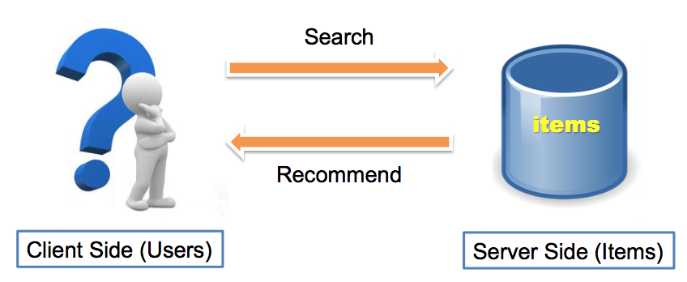

#### 種類
- Editorial Systems - 人工編輯
- Global Recommendation - 推薦「最熱門」或「最新穎」的產品
- Personalized Systems - 個人化，如 Amazon, Netflix, Facebook, ...

#### 步驟
- 蒐集已知 rating
  - 明確的 (Explicit) - 用戶給分，如電影評分 1~5 顆星
  - 隱喻的 (Implicit) - 點擊商品連結、放到興趣清單、放到購物車、購買
- 預測未知 rating
- 評估模型

#### 評估 Explicit Ratings
- 越接近 ground truth，效能越好
- Root Mean Square Error (RMSE)

#### 評估 Implicit Ratings
- 排名越高、效能越好
- Normalized Discounted Cumulative Gain (NDCG)
- 假設 implicit ratings 只有 positive ground truth

#### 未知評分預測，很難
- Sparseness problem
  - 大部份用戶只有給少數 item 評分
- Cold-start problem
  - 新的 item 沒有評分
  - 新的 user 沒有評分歷史

### 根據內容過濾 (Content-based Filtering)
- 主要概念：根據用戶與商品特性建立推薦系統
- 主要問題：用戶不願提供資訊
  - Pseudo User Profile: 根據用戶過去的動作，建立側寫

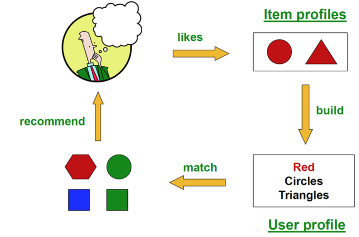

#### 優點
- 客製化推薦
- 商品方面沒有 cold-start 問題
- 容易解釋為何推薦

#### 缺點
- 不容易定義適當的特徵
- 新用戶沒有側寫 (cold-start)
- 側寫之外，用戶可能有其他多重興趣
- 隱私權問題

### 協同式過慮 (Collaborative Filtering)
- 同時考量多個用戶與商品

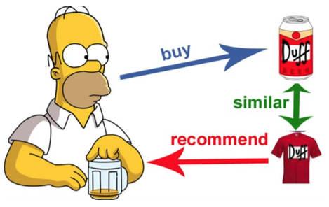

#### 假設
- 類似商品有類似評價
- 類似用戶有類似偏好

#### 不需抽取特徵
- 依賴用戶過去的行為
- 使用用戶關係與商品關係預測

#### 優點
- 容易理解與實作
- 不需要選取特徵

#### 缺點
- 需要長時間計算
- 流行傾向
- cold-start problem
- 如果矩陣太多空白，不容易找到評價相同商品的用戶

### LF 模型 (Latent Factor Models)
- CF 的變形
- CF 矩陣太多空白，透用 ALS (Alternating Least Square) 解決運算上的問題
- 使用 SGD (Stochastic Gradient Descent) 快速找到最佳解

> 理論太硬了，有機會再回頭複習

### LF 模型的變化 (Variations of Latent Factor Models)
- MF with Context: Tensor Factorization
- Bayesian Personalized Ranking (BPR)
